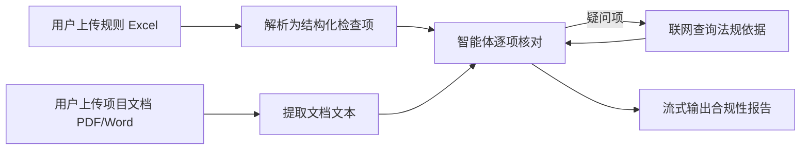

# 智能体报告评审系统 — 实施规划

## 一、系统概述

基于现有 AgentScope 框架（[main.py](file:///Users/cstcloud001/Documents/coding/shengtai/agent-sample/main.py)），构建一个**合规性审查智能体**。用户先上传审查规则（Excel），再上传项目文档（PDF/Word），智能体逐项核对并生成合规性检查报告。



---

## 二、技术架构

### 2.1 核心变更（相对现有代码）

| 维度 | 现有 | 目标 |
|------|------|------|
| 路由 | `@app.query()` | `@app.endpoint('/process')` + `@app.get('/process')` |
| 参数 | `Iterable[Msg]` | Pydantic `BaseModel` |
| 返回 | yield messages | yield `Msg` (自动转 JSON + SSE) |
| 前端 | 无 | `GET /process` 返回 HTML |
| 端口 | 默认 | 8080 |
| 文件处理 | 无 | Excel 规则解析 + PDF/Word 文本提取 |

### 2.2 依赖新增

```
openpyxl      # Excel 解析
pdfplumber    # PDF 文本提取
python-docx   # Word 文本提取
```

---

## 三、任务拆解（共 6 个任务）

### Task 1：Pydantic 请求模型 & 文件处理工具函数

**目标**：定义请求体模型，实现文件解析逻辑。

**要点**：
- 定义 `ProcessRequest(BaseModel)`，包含 `rules_base64`、`rules_filename`、`doc_base64`、`doc_filename` 四个字段（前端以 Base64 编码上传文件）
- 编写 `parse_excel_rules(base64_data)` → 返回结构化检查项列表（每项含：序号、检查项名称、检查内容、检查方法、依据来源）
- 编写 `extract_document_text(base64_data, filename)` → 根据后缀名调用 `pdfplumber` 或 `python-docx` 提取全文文本
- 无需类型标注

```python
# 伪代码示意
class ProcessRequest(BaseModel):
    rules_base64 = ""
    rules_filename = ""
    doc_base64 = ""
    doc_filename = ""

def parse_excel_rules(b64_data):
    # openpyxl 加载 → 遍历行 → 返回 [{序号, 检查项, 内容, 方法, 依据}, ...]
    ...

def extract_document_text(b64_data, filename):
    # 根据 .pdf / .docx 分别处理
    ...
```

---

### Task 2：智能体提示词 & Agent 构建

**目标**：设计审查专用的系统提示词，构建 ReActAgent。

**要点**：
- 系统提示词应指导智能体：
  1. 接收结构化规则列表和文档全文
  2. 逐项对照检查，明确输出每项的合规/不合规状态
  3. 对疑问项使用工具调用查询公开法规
  4. 最终生成 Markdown 格式的合规性报告，**重点突出不合规意见**
- 保留现有 `toolkit`（知识库 + MCP），用于联网查询法规
- Agent 的 `name` 设为 `'审查智能体'`，便于前端区分角色

```python
SYSTEM_PROMPT = """你是一个专业的项目报告合规性审查智能体。
你将收到：1) 审查规则检查表  2) 项目文档全文
请逐项核对每条检查规则，对照项目文档内容进行合规性判断。
如果某项存在疑问，请使用工具查询相关法律法规或公开标准。
最终输出一份 Markdown 格式的合规性检查报告，重点给出不合规意见。"""
```

---

### Task 3：后端 `@app.endpoint('/process')` 实现

**目标**：替换原 `@app.query()`，实现 SSE 流式审查流程。

**要点**：
- 使用 `@app.endpoint('/process')` 装饰器
- 接收 `ProcessRequest` Pydantic 模型
- 函数体为 `async def` 生成器，`yield` Msg 对象
- 流程：
  1. yield 一条 `Msg(name='系统', content='正在解析规则文件...', role='assistant')` 状态消息
  2. 调用 `parse_excel_rules()` 解析规则
  3. yield 状态消息：已解析 N 条检查项
  4. 调用 `extract_document_text()` 提取文档
  5. yield 状态消息：文档提取完成
  6. 构造用户消息，包含规则列表 + 文档全文，传入 Agent
  7. `async for` 遍历 `stream_printing_messages` 的输出，逐条 yield Msg
  8. 异常时 `await agent.interrupt()`

```python
@app.endpoint('/process')
async def process(request: ProcessRequest):
    yield Msg(name='系统', content='正在解析审查规则...', role='assistant')
    rules = parse_excel_rules(request.rules_base64)
    yield Msg(name='系统', content=f'已解析 {len(rules)} 条检查项，正在提取文档...', role='assistant')
    doc_text = extract_document_text(request.doc_base64, request.doc_filename)
    yield Msg(name='系统', content='文档提取完成，开始审查...', role='assistant')
    
    agent = ReActAgent('审查智能体', SYSTEM_PROMPT, model, formatter, toolkit)
    user_msg = Msg('用户', f'审查规则：\\n{rules_text}\\n\\n项目文档：\\n{doc_text}', role='user')
    
    try:
        async for messages in stream_printing_messages([agent], agent(user_msg)):
            yield messages
    except:
        await agent.interrupt()
```

> [!IMPORTANT]
> - `yield` Msg 对象会被框架自动序列化为 JSON 并加上 `data: ` 前缀
> - Msg 的 `content` 每次是**全量**而非增量
> - 后端不需要手写 `f'data: ...'`

---

### Task 4：前端 HTML（`@app.get('/process')`）

**目标**：返回完整的交互式 HTML 页面。

**要点**：

#### 4.1 页面布局
- 顶部标题栏："智能体报告评审系统"
- 左侧面板：
  - 规则上传区（接受 `.xlsx`、`.xls`）
  - 文档上传区（接受 `.pdf`、`.docx`、`.doc`）
  - "开始审查"按钮
- 右侧面板：
  - 流式输出展示区（按角色分块显示，Markdown 渲染）

#### 4.2 关键前端逻辑

```javascript
// 文件转 Base64
function fileToBase64(file) {
    return new Promise((resolve) => {
        const reader = new FileReader();
        reader.onload = () => resolve(reader.result.split(',')[1]);
        reader.readAsDataURL(file);
    });
}

// 使用 fetch + ReadableStream（不用 EventSource，因为是 POST 且相对路径）
async function startReview() {
    const response = await fetch('./process', {
        method: 'POST',
        headers: { 'Content-Type': 'application/json' },
        body: JSON.stringify({
            rules_base64: rulesB64,
            rules_filename: rulesFile.name,
            doc_base64: docB64,
            doc_filename: docFile.name
        })
    });

    const reader = response.body.getReader();
    const decoder = new TextDecoder();
    // 按 SSE 协议解析 data: 行
    // 用 Msg 的 name 字段区分角色
    // 同一 name 的同一次输出：替换而非追加
}
```

#### 4.3 Msg content 渲染逻辑

```javascript
function renderContent(content) {
    if (typeof content === 'string') {
        return marked.parse(content);
    }
    // content 是 list[dict] 的情况
    if (Array.isArray(content)) {
        return content
            .filter(item => item.type === 'text')
            .map(item => marked.parse(item.text))
            .join('');
    }
    return '';
}
```

#### 4.4 流式替换策略

```javascript
// 维护一个 Map: name -> DOM元素
// 每收到一条 Msg：
//   - 如果 name 对应的元素已存在且是最后一个同名块 → 替换 innerHTML
//   - 如果是新 name 或该 name 的上一次输出已"结束" → 创建新块
```

> [!WARNING]
> - HTML 字符串中的 `\` 必须转义为 `\\`
> - 使用相对路径 `./process` 而非绝对路径
> - 引入 `<script src="https://cdn.jsdelivr.net/npm/marked/marked.min.js"></script>`

---

### Task 5：端口配置 & 启动入口

**目标**：确保 8080 端口运行。

```python
if __name__ == '__main__':
    app.run(port=8080)
```

---

### Task 6：整合为单文件 & `%%writefile` 格式

**目标**：最终交付物为一个 Jupyter cell 代码块。

```python
%%writefile main.py
#!/usr/bin/env python
# ... 全部代码 ...
```

**检查清单**：
- [ ] 第一行为 `%%writefile main.py`
- [ ] 无类型标注
- [ ] `cst.py` 仅 `from cst import CSTKnowledgeBase`，不重新实现
- [ ] 不使用 `@app.query()`
- [ ] `GET /process` 返回 HTML
- [ ] `POST /process`（`@app.endpoint`）处理审查逻辑
- [ ] 不使用 `/` 路由
- [ ] HTML 中 `\` 已转义
- [ ] 端口 8080

---

## 四、完整代码骨架

```python
%%writefile main.py
#!/usr/bin/env python
import base64, io, json
from collections.abc import Iterable
from contextlib import asynccontextmanager
from logging import getLogger

from agentscope.agent import ReActAgent
from agentscope.formatter import OpenAIChatFormatter
from agentscope.message import Msg
from agentscope.model import OpenAIChatModel
from agentscope.pipeline import stream_printing_messages
from agentscope.tool import Toolkit
from agentscope_runtime.engine.app import AgentApp
from fastapi import FastAPI
from fastapi.responses import HTMLResponse
from pydantic import BaseModel
from tiktoken import get_encoding

import openpyxl
import pdfplumber
from docx import Document as DocxDocument

from cst import CSTKnowledgeBase

LOGGER = getLogger('审查智能体')

# ========== Pydantic 请求模型 ==========
class ProcessRequest(BaseModel):
    rules_base64 = ""
    rules_filename = ""
    doc_base64 = ""
    doc_filename = ""

# ========== 文件解析工具 ==========
def parse_excel_rules(b64_data):
    """解析 Excel 规则文件，返回检查项列表"""
    ...

def extract_document_text(b64_data, filename):
    """提取 PDF/Word 文档文本"""
    ...

# ========== 智能体配置 ==========
SYSTEM_PROMPT = """..."""

# ========== 生命周期 & 工具注册 ==========
toolkit = Toolkit()

@asynccontextmanager
async def lifespan(app_instance: FastAPI):
    # 注册工具（知识库、MCP 等）
    yield

app = AgentApp(lifespan=lifespan)
encoding = get_encoding('o200k_base')
formatter = OpenAIChatFormatter()
model = OpenAIChatModel(...)

# ========== GET /process → 前端 HTML ==========
@app.get('/process', response_class=HTMLResponse)
async def get_process_page():
    return """<!DOCTYPE html>..."""

# ========== POST /process → SSE 审查流 ==========
@app.endpoint('/process')
async def process(request: ProcessRequest):
    # 1. 解析规则
    # 2. 提取文档
    # 3. 构造 Agent 并流式输出
    yield Msg(...)

# ========== 启动 ==========
if __name__ == '__main__':
    app.run(port=8080)
```

---

## 五、关键注意事项

> [!CAUTION]
> 1. **Msg.content 可能是 list**：当 `content` 是 `list[dict]` 时，前端需遍历并过滤 `type === 'text'` 的项
> 2. **流式全量替换**：同一智能体的同一次输出，content 总是全量，前端必须替换而非追加
> 3. **HTML 中转义反斜杠**：所有 `\n` 等需写为 `\\n`
> 4. **不用 EventSource**：因为需要 POST 且使用相对路径 `./process`，应使用 `fetch` + `ReadableStream`
> 5. **不重新实现 cst.py**：仅 import 使用

---

## 六、执行顺序建议

| 顺序 | 任务 | 预计复杂度 |
|------|------|-----------|
| 1 | Task 1：Pydantic 模型 + 文件解析 | ⭐⭐ |
| 2 | Task 2：提示词设计 | ⭐ |
| 3 | Task 3：后端 endpoint 实现 | ⭐⭐⭐ |
| 4 | Task 4：前端 HTML | ⭐⭐⭐⭐ |
| 5 | Task 5：端口配置 | ⭐ |
| 6 | Task 6：整合 & writefile 格式 | ⭐ |

> [!TIP]
> 建议按上述顺序在 Claude Sonnet 4.6 中逐步实现，每个 Task 作为一轮对话，最终在 Task 6 整合输出。
